Before large language models, before transformers, before BERT: there was Word2Vec. Introduced in the seminal <a href="https://arxiv.org/abs/1301.3781" target="_blank" rel="noopener noreferrer">Word2Vec paper by Google in 2013</a>, it was one of those rare works that changed how an entire field thinks about a problem. The core ideas still underpin how we represent language in machines today.

This post won't take you through the mathematics. It will take you through the *thinking*: the intuition behind why Word2Vec works, what it actually learns, and why the architecture is designed the way it is. By the end, you'll have a clear mental model of the whole pipeline, from raw text to meaningful word representations.

---

## The Problem: Computers Don't Understand Words

Computers work with numbers. Words are symbols. At some point, we have to choose how to convert one into the other.

The most obvious approach: give each word a unique integer. "cat" = 1, "dog" = 2, "banana" = 3. This works for storage but is useless for learning, because 1 is no closer to 2 than it is to 3. The model has no way to know that *cat* and *dog* are more related than *cat* and *banana*.

A slightly more principled version is **one-hot encoding**. Each word gets its own vector: a long list of zeros with a single 1 at the position for that word.

```
Vocabulary: [cat, dog, banana, runs, happy]

cat    → [1, 0, 0, 0, 0]
dog    → [0, 1, 0, 0, 0]
banana → [0, 0, 1, 0, 0]
```

These vectors technically represent words, but they represent them terribly. The similarity between any two one-hot vectors is exactly zero. Every word is equally unrelated to every other, so *cat* is as distant from *dog* as it is from *banana*. There is no semantic information here, only identity.

Worse, with a real vocabulary of 50,000+ words, every vector is 50,000 dimensions long, and 49,999 of those values are always zero. Wasteful, and it doesn't scale.

We need something better.

---

## A Better Idea: Words as Points in Space

What if, instead of sparse binary vectors, we gave each word a short dense vector (say, 300 real numbers) and trained those numbers so that *similar words end up near each other*?

This is the central idea behind **word embeddings**. Each word is a point in a high-dimensional geometric space. Proximity in that space reflects similarity in meaning.

Imagine it in two dimensions (the real spaces have hundreds of dimensions, but the intuition carries):

```
                        ●  joyful
              ●  happy
                                          ●  cat
       ●  gloomy                   ●  dog
              ●  sad
```

Emotion words cluster in one region. Animal words cluster in another. Words that are used in similar ways end up living near each other.

But where do these vectors come from? We have to *learn* them, and here's where the magic begins.

---

## The Key Insight: You Are the Company You Keep

The guiding principle behind Word2Vec was stated by the British linguist J.R. Firth in 1957:

> *"You shall know a word by the company it keeps."*

It's a very simple idea: words that appear in similar contexts tend to have similar meanings. Consider:

- "I bought a new **car** yesterday."
- "She drives her **vehicle** to work."
- "The **automobile** broke down on the highway."

The words *car*, *vehicle*, and *automobile* all appear surrounded by words like *drive*, *bought*, *broke down*, *highway*. Their contexts are almost identical. Therefore, they probably mean similar things.

Word2Vec puts this intuition to work. It doesn't read a dictionary. It doesn't use hand-crafted rules. It just reads raw text and learns which words tend to appear near which other words. The vectors that emerge naturally encode semantic relationships.

This is **self-supervised learning**: the supervision signal (which words appear together) comes from the data itself, for free and more importantly at scale!

---

## What Does an Embedding Actually Look Like?

To make this concrete, imagine training embeddings in a tiny 3-dimensional space where each dimension has a loose interpretation:

```
              Dimension:  [ royalty,  gender,  power ]

king          →           [  0.95,   -0.70,   0.90  ]
queen         →           [  0.92,    0.75,   0.85  ]
man           →           [  0.05,   -0.70,   0.10  ]
woman         →           [  0.04,    0.75,   0.08  ]
```

*(These numbers are illustrative, not from a real model.)*

Notice what falls out: <em>king</em> and <em>queen</em> are similar in the royalty and power dimensions but differ in gender. Words <em>king</em> and <em>man</em> share the gender dimension. This structure gives rise to the famous <a href="https://www.technologyreview.com/2015/09/17/166211/king-man-woman-queen-the-marvelous-mathematics-of-computational-linguistics/" target="_blank" rel="noopener noreferrer">analogy</a>:

```
vector(king) − vector(man) + vector(woman) ≈ vector(queen)
```

The model discovered that the difference between *king* and *queen* mirrors the difference between *man* and *woman*: a gender transformation. It found this purely from co-occurrence statistics, without ever being told that gender is a concept that exists.

This is why people found Word2Vec so striking in 2013. A task that feels like reasoning (solving analogies) emerged from a shallow neural network trained on raw text.

**A quick note on the dimensions:** The labels used above ("royalty", "gender", "power") are illustrative. In a real Word2Vec model, you get hundreds of dimensions with no names attached - the model doesn't tell you what each one represents, and there's no reliable way to look at a dimension and say "this one captures gender" or "this one captures social status." The structure is real and measurable (the vector arithmetic works), but what any individual dimension actually encodes remains opaque. The named dimensions here are mentioned here for conceptual understading, it is not a feature of the model.

---

## The Training Setup: A Sliding Window

Before looking at architectures, we need to understand how Word2Vec creates training data. It uses a simple **sliding window** over the corpus.

Given a sentence and a window of size 2, we look at each word and the 2 nearest neighbours on each side:

```
Sentence:  "the  cat  sat  on  the  mat"

                  ↕ window size = 2 ↕
              [the  cat] [sat] [on  the]
                           ↑
                     centre word
```

For the centre word *"sat"*, the context words are *["the", "cat", "on", "the"]*. As the window slides left to right across every sentence in the corpus, it generates a large collection of (centre word, context word) pairs. These pairs are the training examples, with no human labelling required.

Word2Vec has two architectures that use these pairs in opposite ways.

---

## Architecture 1: CBOW (Continuous Bag of Words)

**The task:** given the surrounding context words, predict the missing centre word.

Think of it as a **fill-in-the-blank** exercise:

> "The quick ___ fox jumps."

You're given the words around the gap. Your job is to fill it in. *Brown* fits. *Invisible* might plausibly fit. *Refrigerator* almost certainly doesn't. Your ability to answer comes from knowing which words naturally appear in those surroundings, and that's exactly what CBOW learns.

**How training examples are constructed:**

```
Sentence:  "the  quick  brown  fox  jumps"
Window = 2

Centre: "brown"   Context: ["the", "quick", "fox", "jumps"]
Centre: "fox"     Context: ["quick", "brown", "jumps", ...]
```

**The computational flow:**

```
Context words: ["the", "quick", "fox", "jumps"]
                           ↓
             look up each word's embedding vector
                           ↓     
                    average them together
                           ↓
               one blended context vector
                           ↓
               predict: which word goes here?
                           ↓
                        "brown" ✓
```

The model takes the embeddings of all context words, averages them into a single vector, and uses that blended representation to predict the centre word.

**The "Bag" part:** CBOW treats context words as an unordered set. It doesn't care whether *quick* comes before or after *fox*, only that both are present. This makes training faster, but throws away positional information. It works well in practice because meaning is mostly encoded in *what* words appear together, not the order (this is one of the aspects where this model falls short).


---

## Architecture 2: Skip-gram

**The task:** given the centre word, predict each of the surrounding context words.

This is the reverse of CBOW. Instead of reading the context and guessing the blank, you're given the blank-filler and asked to reconstruct the context.

Think of it as a memory exercise: if I tell you the word is *coffee*, what other words would you expect to find in the same sentence? *Morning, cup, hot, café, brew*: all reasonable guesses. Skip-gram trains the model to make exactly those guesses.

**How training examples are constructed:**

```
Sentence:  "the  quick  brown  fox  jumps"
Window = 2

Centre: "brown"  →  predict "the"
Centre: "brown"  →  predict "quick"
Centre: "brown"  →  predict "fox"
Centre: "brown"  →  predict "jumps"
```

Each centre word generates *multiple* training pairs, one per context word. This creates a much richer set of training examples from the same text.

**The computational flow:**

```
               Centre word: "brown"
                       ↓
             look up its embedding vector
                       ↓
                run through model
                       ↓
             predict each context word
                       ↓
             "the" "quick" "fox" "jumps"
```

---

## CBOW vs Skip-gram: The Key Differences

| | CBOW | Skip-gram |
|---|---|---|
| **Input** | Multiple context words | One centre word |
| **Predicts** | One centre word | Multiple context words |
| **Training pairs** | Fewer, averaged | Many more, individual |
| **Speed** | Faster | Slower |
| **Strength** | Common words, large corpora | Rare words, smaller corpora |
| **Analogy** | Fill in the blank | Predict the neighbourhood |


The most important behavioural difference is how each model handles **rare words**.

CBOW averages the context vectors before making a prediction. For frequent words surrounded by other frequent words, this produces a clean, stable signal. But when a rare word appears in the context, its contribution gets diluted by all the common words around it, barely influencing the prediction.

Skip-gram flips this. When a rare word is the *centre* word, the model must generate successful predictions from *only* that word's vector. Its vector has to pull all the weight. This pressure forces the model to develop a richer, more meaningful representation for rare words. That's why Skip-gram is preferred in most practical applications, especially for domain-specific vocabulary where specialist terms appear infrequently.

---